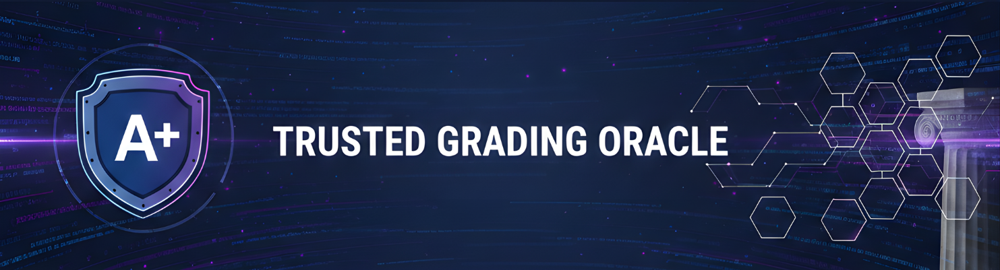
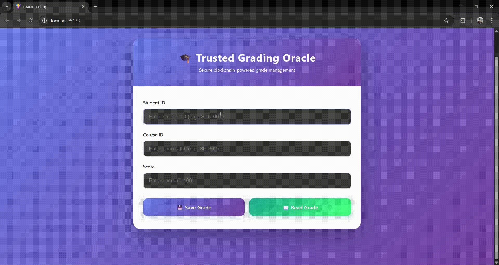
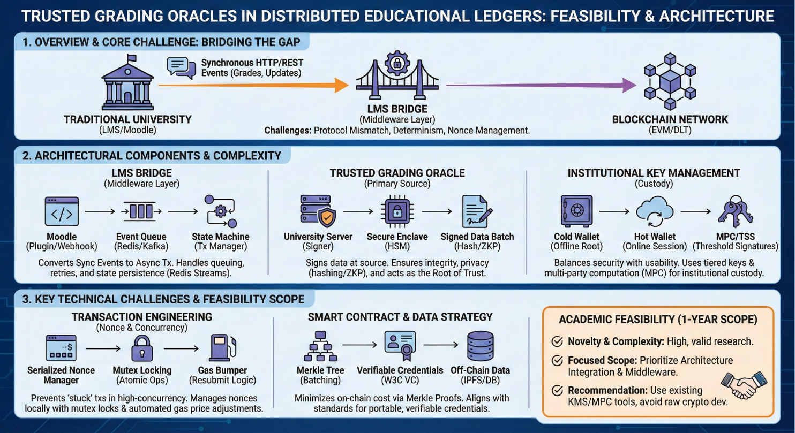
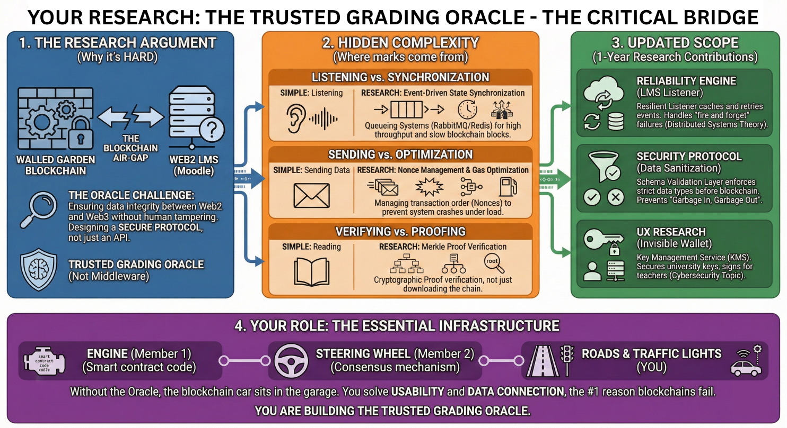

# 🎓 Silent Bridge: Secure Academic Grading Enterprise


**Status:** Phase 2 Complete (Decentralized Middleware & Private Ledger MVP Active)  
**Author:** Nithika Perera  
**Institution:** SLIIT (BSc Hons in Information Technology - Software Engineering)  
**Research Component:** Seamless LMS Integration (Middleware Bridge)

---

## 📺 Demo Preview

*Figure 1: Real-time interaction between the React Frontend and the Silent Bridge Middleware.*

---

## 📌 Project Overview
This project addresses the vulnerability of centralized academic databases. Currently, university grades stored in SQL databases are susceptible to unauthorized modification, server failure, or administrative manipulation.

The **Silent Bridge** application provides a secure layer of trust by cryptographically sealing academic records. It acts as a bridge between traditional Web2 Learning Management Systems and secure, immutable storage technologies, ensuring grades are mathematically verifiable and practically tamper-proof without requiring lecturers to manage complex Web3 crypto-wallets.

### 🏗 High-Level Architecture


---

## 🧩 My Research Component: Seamless LMS Integration
This project is part of a 4-member research group. My specific contribution focuses on the **Silent Bridge Middleware**. This component is designed to ingest standard grading sheets (Excel/CSV), securely extract the data, and generate zero-knowledge cryptographic hashes (SHA-256) before anchoring them to an immutable private ledger.


*Figure 2: The logic flow for the Seamless LMS Integration module.*

---

## ✅ Current Features (MVP)
The current repository has been refactored into a modern 3-Tier Architecture to demonstrate the end-to-end flow:

* **Institutional SSO Login:** A mocked, secure entry point for authorized academic staff.
* **Data Ingestion Portal:** A seamless drag-and-drop interface for lecturers to upload `.xlsx` or `.csv` grading sheets.
* **Silent Bridge Middleware:** An Express.js engine that intercepts uploads, standardizes the data schema, and prevents duplicate processing.
* **Cryptographic Sealing (SHA-256):** Every batch of grades is mathematically sealed with a Provenance Hash, ensuring strict data integrity.
* **Private Ledger:** A simulated immutable data store (`database.json`) that securely anchors the hashed records.
* **Corporate Verification Portal:** A dedicated interface where employers can query a candidate's ID to instantly cryptographically verify their academic transcript against the ledger.

---

## 🛠 Tech Stack

| Component | Technology | Description |
| :--- | :--- | :--- |
| **Frontend UI** |  | React + Vite (Glassmorphism Design) |
| **Middleware Engine** |  | Express.js, Multer, Crypto-JS, xlsx |
| **HTTP Client** |  | Promise-based HTTP client for the browser |
| **Storage Layer** |  | Simulated Private Ledger (`database.json`) |

---

## 🚀 How to Run Locally

### Prerequisites
1.  Node.js installed.
2.  (Optional) A modern browser for the best UI experience.

### Installation

1.  **Clone the repository:**
    ```bash
    git clone [your-repo-link]
    cd grading-dapp
    ```

2.  **Start the Silent Bridge Middleware (Backend):**
    Open a terminal and run:
    ```bash
    cd middleware
    npm install
    node src/server.js
    ```
    *The middleware will run on `http://localhost:5000`.*

3.  **Start the React Frontend (UI):**
    Open a second terminal and run:
    ```bash
    cd frontend
    npm install
    npm run dev
    ```
    *The frontend will run on `http://localhost:5173`.*

4.  **Access the Application:**
    Navigate to the local host link, log in via the SSO portal, and explore the Data Ingestion and Corporate Verification portals!

---

## 🔮 Roadmap: What's to Come

### Phase 3: The Decentralized Reviewer Network (DON)
* **Objective:** Remove individual lecturer bias.
* **Mechanism:** Grades will not be finalized immediately. Instead, they will enter a "Proposed" state. A random subset of anonymous reviewers (other lecturers/top students) must vote to "Approve" the grade.

### Phase 4: Privacy & Scalability
* **Zero-Knowledge Proofs (ZKP):** Allow students to prove they passed a course without revealing their exact score or identity publicly.
* **True Blockchain Integration:** Migrating the Private Ledger simulated storage back to a secure smart contract (e.g., Ethereum Sepolia) for global decentralization.
